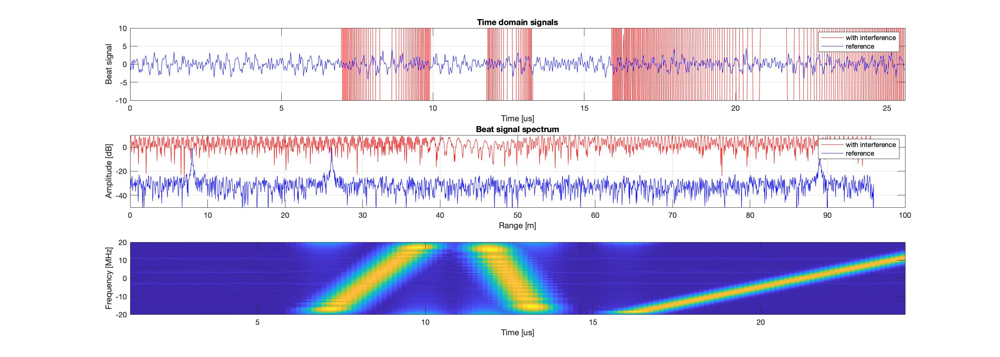

#  Automotive Radar Interference Mitigation data sets (ARIM-v2)                                                                                    

We propose a novel large scale database consisting of radar data samples, generated automatically while trying to replicate a realistic automotive scenario with variable interference sources.
  
We provide two ways to obtain data:
- directly by downloading the data from below listed links
- generate the data by using the provided scripts

-----------------------------------------



-----------------------------------------                                                                                                                                      
## Download data set

##### You can download the data set from here: 

https://fmiunibuc-my.sharepoint.com/personal/radu_ionescu_fmi_unibuc_ro/_layouts/15/onedrive.aspx?id=%2Fpersonal%2Fradu%5Fionescu%5Ffmi%5Funibuc%5Fro%2FDocuments%2FARIM%2FARIM%2Dv2&originalPath=aHR0cHM6Ly9mbWl1bmlidWMtbXkuc2hhcmVwb2ludC5jb20vOmY6L2cvcGVyc29uYWwvcmFkdV9pb25lc2N1X2ZtaV91bmlidWNfcm8vRXJwRW5vVmpSY05BcXgtcEt4WWVsREFCRm5uV1ExSFJWSlpXRkhiTXRXYzRaUT9ydGltZT1naGVIVldJNTJFZw

##### You can get the data set paper from here:
https://TBD

## Generate data set
#### In order to generate the ARIM-v2 data set:
1. Run the matlab script arim_matlab/main.m
2. Move the generated file (arim1.mat) in X directory
3. Run the matlab script arim2_matlab/main.m 
4. Run again the matlab script arim2_matlab/main.m, but modify the **nr_interferences** variable to 3.
5. Move the generated files (arim2.mat and arim3.mat) in X directory
3. Run the process.py script as follows:
```bash
python process.py --arim_data_path path/to/X/dir --output_dataset_path path/to/save
```

#### Information

After the above steps you will have in the path/to/save directory two files: **arim-v2_train.npy** and **arim-v2_test.npy**.
Those files contains the subsets for training (which could be split also in train and evaluation, as described in our paper) and testing.

In order to load the data in python you should run:
```python
import numpy as np
arim = np.load("path/to/dataset", allow_pickle=True)

sb_raw = arim[()]['sb'] # Data with interference
sb0_raw = arim[()]['sb0'] # Data without interference
amplitudes = arim[()]['amplitudes'] # Amplitude information for targets
```
> In order to work properly you need to have a python version older than 3.6
>> We used the following versions:
>> python 3.6.8,
>> numpy 1.17.3

## Run our pretrained models

TBD

## Cite us

TBD

## You can send your questions or suggestions to: 
r.catalin196@yahoo.ro, raducu.ionescu@gmail.com

### Last Update:
August 5, 2020 


